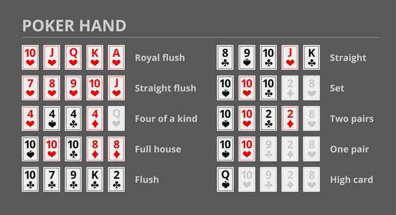
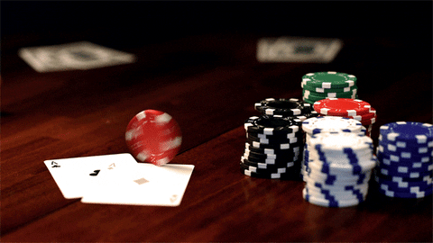

#How to Play Texas Hold em' Poker

## Introduction
Texas Hold em' is a variation of Poker that people play in Casinos, at home, and in tournements all the time, some people play for real money, while others play just for the thrill of the game. Below are the instructions on how to play the game.

## WARNING
Gamble at your own risk, this is just an instructional step by step guide on how to play the game, this is not encouraging you to play, and should just be used as a method of teaching

## Steps
### 1 Setting up the game
* Decide a designated amount of chips to give each player
* Get a standard deck of 52 playing cards and remove the jokers
* Shuffle the deck well and determine a dealer for the hand at random

### 2 Dealing the cards/Blinds
* The dealer will give each player one card at a time, starting to the left of the dealer and going around the table clockwise
* Once each player has 2 cards, the dealer stops dealing and places the cards in the middle of the table
* The player two players to the left of the dealer put in a predetermined amount of chips before the hand that are called blinds
* The player directly left of the dealer is referred to as small blind and the player directly left to the small blind is referred to as big blind

### 3 First Round of Betting
* Once each player has looked at both of their cards, the player directly left  of the big blind can either match the blind, raise the bet, or fold their hand
* This cycle repeats until the betting gets back around to the big blind and everybody has either folded their hand or matched the bets of the other players
* The objective of the game is to have your two cards and the 5 cards that will be on the table make one of the hands listed below 

### 4 The Flop
* The dealer will then take 1 card of the top of the deck and set it aside as to avoid any potential cheating with the deck (this is known as the burn card)
* The dealer will then take 3 cards in a row from the top of the deck and lay them face up for everyone to see
* There will now be another round of betting starting with the small blind this time
* Once again the group will go around in a cicle, either deciding to check(not bet when no existing bet has been placed this round) bet, raise the current bet, or fold their hand
* Once all of the betting is done, another card is shown

### 5 The Turn
* Much like the flop the dealer will now take one card and burn it, then take another card and lay it next to the 3 face up cards
* The remaining players are now entering another round of betting, checking, folding, or raising an existing bet, depending on how much each player likes their cards

### 6 The River
* Once again, like the turn and flop, another card is burned and then another card is layed face up next to the other 4, this will be the last card
* One final round of betting between the remaining players takes place

### 7 The Showdown 

* In the showdown each player must reveal their cards to the group starting with the person who bet the most recent 
* The player with the best hand out of the players remaining wins all of the chips that were bet by anyone throughout the hand whether they are still in the hand or not 

### 8 The end of the game
* During a poker tournement, The game ends when one player is standing with all of the chips that usually recieves a grand prize
* During a cash game, A player can leave whenever they desire with as little or as much profit as they want 
* They may be at a less or greater amount than they started with
* Leave the establishment and (hopefully) enjoy your winnings

